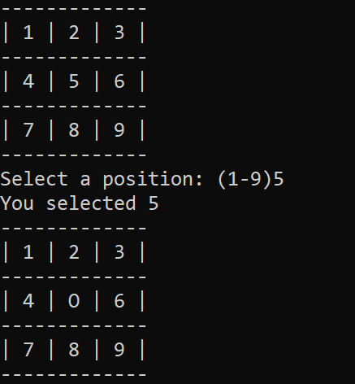
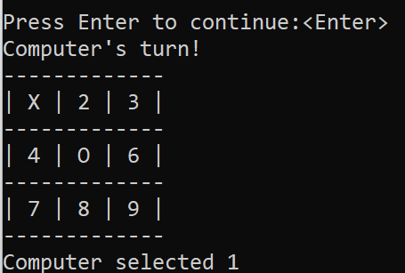
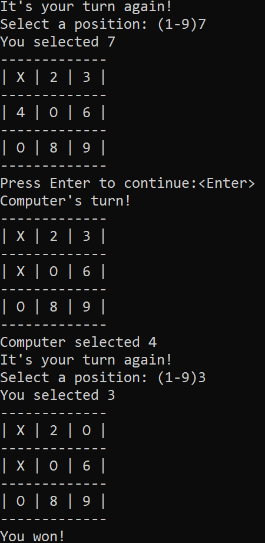

# About the Project: TicTacToe Java Console Game
You will play a tic-tac-toe game with the computer.

## How it will look like:

## Built with
* Java

## Installation
* Download and extract the zip file or clone the repository to your local folder.

## Compilation
* javac ./*.java

## Run the Application
* java ./*.java
